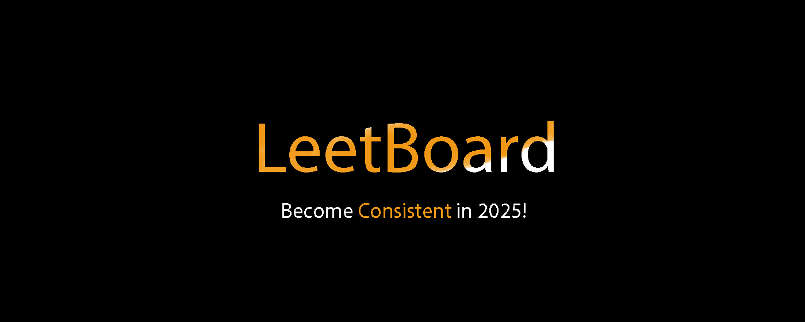

# LeetBoard Chrome Extension


LeetBoard is a Chrome extension that allows users to track their LeetCode progress and collaborate with friends. This repository contains the source code for the extension and its configuration.

## Table of Contents

1. [Prerequisites](#prerequisites)
2. [Installation](#installation)
3. [Contributing](#contributing)
4. [Contact](#contact)
5. [License](#license)

## Prerequisites

Before you begin, make sure you have the following tools installed on your machine:

- Node.js
- npm
- Firebase account for Firebase configuration
  Node.js
  npm
  Firebase account for Firebase configuration

## Installation

Follow these steps to set up the project locally:

1. Clone the Repository

First, clone the repository to your local machine:

```bash
git clone https://github.com/your-username/leetboard.git
cd leetboard
```

2. Install Dependencies

Install the required npm packages:

```bash
npm install
```

3. Firebase Setup

In order to set up Firebase for the extension, follow these steps:

- Go to [Firebase Console](https://console.firebase.google.com/).
- Create a new Firebase project or use an existing one.
- Register your app with Firebase and obtain the configuration details.

Fill in the details of your Firebase config in src/firebase_config.js:

```bash
// firebase_config.js
export const firebaseApp = initializeApp({
apiKey: "<YOUR-API-KEY>",
authDomain: "<YOUR-AUTH-DOMAIN>",
projectId: "<YOUR-PROJECT-ID>",
storageBucket: "<YOUR-STORAGE-BUCKET>",
messagingSenderId: "<YOUR-MESSAGING-SENDER-ID>",
appId: "<YOUR-APP-ID>",
measurementId: "<YOUR-MEASUREMENT-ID>"
});
```

You can reference this configuration in any JavaScript file by importing the firebaseApp:

```bash
import { firebaseApp } from './firebase_config';
```

4. Webpack Configuration

The project uses Webpack for bundling. There are three main Webpack configuration files:

- webpack.development.js: Used for development purposes. Configure this script to suit your development needs. Run the following command to build the development version of the extension:

```bash
npm run build
```

- webpack.production.js: Used for the production release. Configure this script to prepare your extension for release. Run the following command to build the production version:

```bash
  npm run release
```

- webpack.common.js: This file contains the common bundler configurations shared between both development and production scripts.

5. Extension Code

All the extension's development code should be placed in the **src/** folder. This includes:

- The manifest.json file should also be in the src folder.
- Any JavaScript, CSS, or assets for the extension should be placed in the appropriate directories within the src folder.

6. Run the Extension Locally

For local testing and development:

- Build the extension using npm run build.
- Open Chrome and navigate to chrome://extensions/.
- Enable Developer mode and click Load unpacked.
- Select the dist folder in your project directory.

7. Firebase Integration

Firebase is used for backend services such as authentication and data storage. Ensure that you have set up Firebase correctly and are importing and using the firebaseApp as shown above.

## Contributing

To contribute to this project, follow these steps:

1. Fork this repo.
   Click the "Fork" button at the top-right corner of this repository to create a copy in your GitHub account.

2. Clone the forked repo to your local machine.

```bash
git clone https://github.com/your-username/leetboard.git
cd leetboard
```

3. Create a new branch and switch to it.

```bash
git switch -c your-branch-name
```

4. Make the necessary changes and commit them.

```bash
git add .
git commit -m "Your commit message"
```

5. Push your changes to your forked repo.

```bash
git push -u origin your-branch-name
```

6. Submit a pull request.

- Navigate to your repo on GitHub.
- Click the "Compare & pull request" button.
- Provide a clear and detailed description of your changes in the PR template.
- Link any related issues if applicable (e.g., "Fixes #123").

**IMPORTANT**: We welcome contributions to **LeetBoard**! Before contributing, please follow these steps:

1. **Join our [Discord Server](https://discord.gg/KmhtPxg5Tb)**

   - Once you're in the server, introduce yourself and have a quick chat with me (the project owner).

2. **Discuss Your Changes**

   - We’ll go over the Contributor Guidelines and make sure we’re on the same page regarding your proposed changes.

3. **Make Your Pull Request**
   - After discussing your changes and getting the green light, feel free to submit your pull request.

This helps us ensure that your contributions are aligned with the project and maintain its quality.

## Contact

For any inquiries, please contact stevealdrin7@gmail.com.

## License

LeetBoard is dual-licensed under the **AGPL-3.0 License** and a **Commercial License**.

For more information refer the License file.
